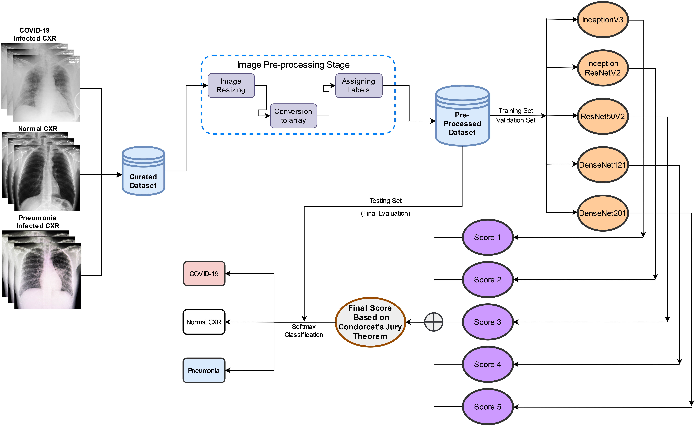

# Ensemble of Deep Neural Networks based on Condorcet’s Jury Theorem for screening Covid-19 and Pneumonia from radiograph images




## Abstract

COVID-19 detection using Artificial Intelligence and Computer-Aided Diagnosis has been the subject of several studies. Deep Neural Networks with hundreds or even millions of parameters (weights) are referred to as ”black boxes” because their behavior is difficult to comprehend, even when the model’s structure and weights are visible. On the same dataset, different Deep Convolutional Neural Networks perform differently. So, we do not necessarily have to rely on just one model; instead, we can evaluate our final score by combining multiple models. While including multiple models in the voter pool, it is not always true that the accuracy will improve. So, In this regard, the authors proposed a novel approach to determine the voting ensemble score of individual classifiers based on **Condorcet’s Jury Theorem (CJT).** The authors demonstrated that the theorem holds while ensembling the **N** number of classifiers in Neural Networks. With the help of CJT, the authors proved that a model’s presence in the voter pool would improve the likelihood that the majority vote will be accurate if it is more accurate than the other models. Besides this, the authors also proposed a Domain Extended Transfer Learning (DETL) ensemble model as a soft voting ensemble method and compared it with CJT based ensemble method. Furthermore, as deep learning models typically fail in real-world testing, a novel dataset has been used with no duplicate images. Duplicates in the dataset are quite problematic since they might affect the training process. Therefore, having a dataset devoid of duplicate images is considered to prevent data leakage problems that might impede the thorough assessment of the trained models. The authors also employed an algorithm for faster training to save computational efforts. Our proposed method and experimental results outperformed the state-of-the-art with the DETL-based ensemble model showing an accuracy of 97.26%, COVID-19, sensitivity of 98.37%, and specificity of 100%. CJT-based ensemble model showed an accuracy of 98.22%, COVID-19, sensitivity of 98.37%, and specificity of 99.79%.


## Contributors<a name="1"></a>

- Gaurav Srivastava  [LinkedIn](https://www.linkedin.com/in/gaurav-srivastava-726239157/) [Google Scholar](https://scholar.google.com/citations?user=fT_GOxEAAAAJ&hl=en)
- Dr. Nitesh Pradhan  [LinkedIn](https://www.linkedin.com/in/nitesh-pradhan-86b071159/) [Google Scholar](https://scholar.google.com/citations?hl=en&user=tLNOunEAAAAJ)
- Yashwin Saini  [LinkedIn](https://www.linkedin.com/in/yashwin-saini-961304158/)


## Requirements

- [NumPy](https://numpy.org/)
- [Python3](https://www.python.org/)
- [Tensorflow](https://www.tensorflow.org/)
- [Keras](https://keras.io/)

## Usage

1. Clone the repository: `git clone https://github.com/pradhan94300/juryEnsemble.git`
2. Place your test data and labels in `data/test_data.npy` and `data/test_labels.npy`, respectively.
3. Place your saved models in the `models` directory.
4. Run the script: `python jury.py`

## License

This project is licensed under the MIT License - see the [LICENSE](LICENSE) file for details.


## Citation

If you find this work useful for your publications, please consider citing:
```bibtex
@article{srivastava2022ensemble,
  title={Ensemble of Deep Neural Networks based on Condorcet’s Jury Theorem for screening Covid-19 and Pneumonia from radiograph images},
  author={Srivastava, Gaurav and Pradhan, Nitesh and Saini, Yashwin},
  journal={Computers in Biology and Medicine},
  volume={149},
  pages={105979},
  year={2022},
  issn = {0010-4825},
  publisher={Elsevier},
  doi = {https://doi.org/10.1016/j.compbiomed.2022.105979},
  url = {https://www.sciencedirect.com/science/article/pii/S0010482522007065},
}
```
